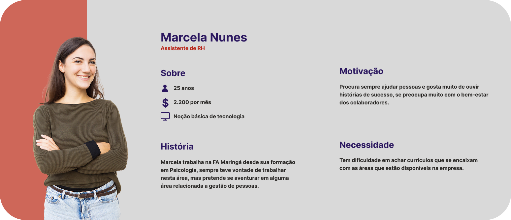

# Web Application Document - Projeto Individual - Módulo 2 - Inteli

## Pesquisador de Curriculo

#### Rodrigo Ferraz

## Sumário

1. [Introdução](#c1)  
2. [Visão Geral da Aplicação Web](#c2)  
3. [Projeto Técnico da Aplicação Web](#c3)  
4. [Desenvolvimento da Aplicação Web](#c4)  
5. [Referências](#c5)  

 

## 1. Introdução

A solução Pesquisador de Currículo nasceu para ser um auxiliador para o time de RH, um site simples com um sistema de busca, onde o usuário terá que digitar as informações que deseja encontrar em um currículo. Todos os currículos que a empresa recebe estarão armazenados em uma base de dados que, posteriormente, será acessada para buscar os currículos que condizem com o que o usuário escreveu na busca. Como resultado, o sistema retorna as informações mais importantes para que o time de RH entre em contato com os possíveis futuros colaboradores: nome e número. 

Dessa forma, o time de RH não precisará mais perder tempo acessando pastas com quantidades imensas de pdf's e conseguirá ter mais assertividade na contratação contatando pessoas que realmente estão interessadas com as vagas que estão abertas.

---

## 2. Visão Geral da Aplicação Web

### 2.1. Personas

Basicamente, personas são representações dos usuários da solução proposta, criadas com base nas características, necessidades e motivações do público-alvo, com isso, a equipe que realiza o projeto consegue analisar e entender os comportamentos de quem irá usar.

Para o meu projeto, usei o modelo de persona estatística, ou seja, usei dados de pesquisa feitas por mim com o público-alvo da aplicação.

   

### 2.2. User Stories

User Stories são descrições curtas e claras de funcionalidades, escritas do ponto de vista do usuário final. Elas ajudam a entender as necessidades do usuário, facilitando a criação de soluções que atendem diretamente aos seus objetivos e desafios.

| ID   | User Story Persona 1                                                                                                        | Critério de Aceite 1                                                                 | Critério de Aceite 2                                                                 |
|------|--------------------------------------------------------------------------------------------------------------------|---------------------------------------------------------------------------------------|---------------------------------------------------------------------------------------|
| US01 | Como assistente de RH, preciso encontrar os currículos que se encaixam com as áreas que estão disponíveis na FA Maringá, para que as vagas sejam preenchidas com pessoas que tem semelhança e aptidão para cumprir as demandas. | O sistema possui um campo de digitação. | O campo de digitação possui um guia para o usuário saber o que digitar.                       |
| US02 | Como assistente de RH, preciso pesquisar todos os currículos que temos acesso na empresa, para não esquecer nenhum possível colaborador. | O banco de dados possui todos currículos que a empresa possui. | O sistema mostra a quantidade total de currículos que está lendo no momento da requisição. |
| US03 | Como assistente de RH, quero ter acesso as informações do nome e número de todos os currículos que estiverem dentro dos critérios da vaga, para que eu possa mandar mensagem para os possíveis colaboradores. | O sistema deve informar o nome e número dos currículos que estão dentro dos critérios escritos pelo usuário no front-end do site. | O front-end deve ser intuitivo e ter possibilidade de copiar as informações com apenas um clique. |

---

## 3. Projeto da Aplicação Web

### 3.1. Modelagem do banco de dados  (Semana 3)

*Posicione aqui os diagramas de modelos relacionais do seu banco de dados, apresentando todos os esquemas de tabelas e suas relações. Utilize texto para complementar suas explicações, se necessário.*

*Posicione também o modelo físico com o Schema do BD (arquivo .sql)*

### 3.1.1 BD e Models (Semana 5)
*Descreva aqui os Models implementados no sistema web*

### 3.2. Arquitetura (Semana 5)

*Posicione aqui o diagrama de arquitetura da sua solução de aplicação web. Atualize sempre que necessário.*

**Instruções para criação do diagrama de arquitetura**  
- **Model**: A camada que lida com a lógica de negócios e interage com o banco de dados.
- **View**: A camada responsável pela interface de usuário.
- **Controller**: A camada que recebe as requisições, processa as ações e atualiza o modelo e a visualização.
  
*Adicione as setas e explicações sobre como os dados fluem entre o Model, Controller e View.*

### 3.3. Wireframes (Semana 03)

Abaixo está um protótipo de baixa fidelidade (wireframe) do visual (front-end) do projeto, a partir deste protótipo é possível ter uma mínima noção daquilo que será o projeto final.

Legenda: a tela da esquerda se refere a tela inicial do site, onde o usuário terá que digitar aquilo que deseja buscar, para seguir à tela da direita é necessário licar no triângulo. Ao abrir a segunda tela, o usuário se depara com a lista de currículos que condizem com a busca feita, ao clicar nos triângulos da lateral as informações dos currículos são expostas (nome, telefone e nome do arquivo), para voltar a tela inicial, é necessário clicar no botão que está na abaixo do último currículo.

   

Link do figma: https://www.figma.com/design/zVCDQ15z9j5WyamLHekpmi/Projeto-Individual---Pesquisador-de-Curriculos?node-id=0-1&t=UdQrFp4fQ5gFKE3a-1

### 3.4. Guia de estilos (Semana 05)

*Descreva aqui orientações gerais para o leitor sobre como utilizar os componentes do guia de estilos de sua solução.*

### 3.5. Protótipo de alta fidelidade (Semana 05)

*Posicione aqui algumas imagens demonstrativas de seu protótipo de alta fidelidade e o link para acesso ao protótipo completo (mantenha o link sempre público para visualização).*

### 3.6. WebAPI e endpoints (Semana 05)

*Utilize um link para outra página de documentação contendo a descrição completa de cada endpoint. Ou descreva aqui cada endpoint criado para seu sistema.*  

### 3.7 Interface e Navegação (Semana 07)

*Descreva e ilustre aqui o desenvolvimento do frontend do sistema web, explicando brevemente o que foi entregue em termos de código e sistema. Utilize prints de tela para ilustrar.*

---

## 4. Desenvolvimento da Aplicação Web (Semana 8)

### 4.1 Demonstração do Sistema Web (Semana 8)

*VIDEO: Insira o link do vídeo demonstrativo nesta seção*
*Descreva e ilustre aqui o desenvolvimento do sistema web completo, explicando brevemente o que foi entregue em termos de código e sistema. Utilize prints de tela para ilustrar.*

### 4.2 Conclusões e Trabalhos Futuros (Semana 8)

*Indique pontos fortes e pontos a melhorar de maneira geral.*
*Relacione também quaisquer outras ideias que você tenha para melhorias futuras.*

## 5. Referências

_Incluir as principais referências de seu projeto, para que seu parceiro possa consultar caso ele se interessar em aprofundar. Um exemplo de referência de livro e de site:_ 

---
---
