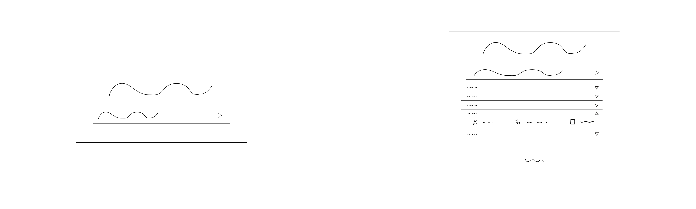

# Web Application Document - Projeto Individual - Módulo 2 - Inteli

## Pesquisador de Curriculo

#### Rodrigo Ferraz

## Sumário

1. [Introdução](#c1)  
2. [Visão Geral da Aplicação Web](#c2)  
3. [Projeto Técnico da Aplicação Web](#c3)  
4. [Desenvolvimento da Aplicação Web](#c4)  
5. [Referências](#c5)  

<br>

## <a name="c1"></a>1. Introdução

A solução Pesquisador de Currículo nasceu para ser um auxiliador para o time de RH, um site simples com um sistema de busca, onde o usuário terá que digitar as informações que deseja encontrar em um currículo. Todos os currículos que a empresa recebe estarão armazenados em uma base de dados que, posteriormente, será acessada para buscar os currículos que condizem com o que o usuário escreveu na busca. Como resultado, o sistema retorna as informações mais importantes para que o time de RH entre em contato com os possíveis futuros colaboradores: nome e número. 

Dessa forma, o time de RH não precisará mais perder tempo acessando pastas com quantidades imensas de pdf's e conseguirá ter mais assertividade na contratação contatando pessoas que realmente estão interessadas com as vagas que estão abertas.

---

## <a name="c2"></a>2. Visão Geral da Aplicação Web

### 2.1. Personas

Basicamente, personas são representações dos usuários da solução proposta, criadas com base nas características, necessidades e motivações do público-alvo, com isso, a equipe que realiza o projeto consegue analisar e entender os comportamentos de quem irá usar.

Para o meu projeto, usei o modelo de persona estatística, ou seja, usei dados de pesquisa feitas por mim com o público-alvo da aplicação.


<div align="center">
  <br>
</div>

### 2.2. User Stories

User Stories são descrições curtas e claras de funcionalidades, escritas do ponto de vista do usuário final. Elas ajudam a entender as necessidades do usuário, facilitando a criação de soluções que atendem diretamente aos seus objetivos e desafios.


| ID   | User Story Persona 1                                                                                                        | Critério de Aceite 1                                                                 | Critério de Aceite 2                                                                 |
|------|--------------------------------------------------------------------------------------------------------------------|---------------------------------------------------------------------------------------|---------------------------------------------------------------------------------------|
| US01 | Como assistente de RH, preciso encontrar os currículos que se encaixam com as áreas que estão disponíveis na FA Maringá, para que as vagas sejam preenchidas com pessoas que tem semelhança e aptidão para cumprir as demandas. | O sistema possui um campo de digitação. | O campo de digitação possui um guia para o usuário saber o que digitar.                       |
| US02 | Como assistente de RH, preciso pesquisar todos os currículos que temos acesso na empresa, para não esquecer nenhum possível colaborador. | O banco de dados possui todos currículos que a empresa possui. | O sistema mostra a quantidade total de currículos que está lendo no momento da requisição. |
| US03 | Como assistente de RH, quero ter acesso as informações do nome e número de todos os currículos que estiverem dentro dos critérios da vaga, para que eu possa mandar mensagem para os possíveis colaboradores. | O sistema deve informar o nome e número dos currículos que estão dentro dos critérios escritos pelo usuário no front-end do site. | O front-end deve ser intuitivo e ter possibilidade de copiar as informações com apenas um clique. |


---

## <a name="c3"></a>3. Projeto da Aplicação Web

### 3.1. Modelagem do banco de dados

A modelagem do banco de dados do projeto se baseia em apenas uma tabela que possui as colunas: id, nome, area_de_interesse, idade, numero e arquivo, todas essas colunas serão requisitadas pelo sistema por meio do método READ (do CRUD).

```sql
CREATE TABLE curriculos (
    id INT PRIMARY KEY, 
    nome VARCHAR(100) NOT NULL, 
    area_de_interesse VARCHAR(50) NOT NULL,  
    idade INT NOT NULL,  
    numero VARCHAR(20) NOT NULL,
    arquivo VARCHAR(255) NOT NULL
);
```
<div align="center">
  <br>
</div>


### 3.1.1 BD e Models

O model `curriculoModel.js` é necessário para filtrar os currículos por meio da palavra-chave digitada pelo usuário na barra de pesquisa da tela `home.ejs`, por meio desse código:

````js
  SELECT id, nome, area_de_interesse, idade, numero, arquivo
  FROM curriculos
  WHERE area_de_interesse ILIKE $1
````

### 3.2. Arquitetura

<div align="center">
  <br>
</div>


### 3.3. Wireframes

Abaixo está um protótipo de baixa fidelidade (wireframe) do visual (front-end) do projeto, a partir deste protótipo é possível ter uma mínima noção daquilo que será o projeto final.

Legenda: a tela da esquerda se refere a tela inicial do site, onde o usuário terá que digitar aquilo que deseja buscar, para seguir à tela da direita é necessário licar no triângulo. Ao abrir a segunda tela, o usuário se depara com a lista de currículos que condizem com a busca feita, ao clicar nos triângulos da lateral as informações dos currículos são expostas (nome, telefone e nome do arquivo), para voltar a tela inicial, é necessário clicar no botão que está na abaixo do último currículo.

<div align="center">
  <br>
</div>

Link do figma: https://www.figma.com/design/zVCDQ15z9j5WyamLHekpmi/Projeto-Individual---Pesquisador-de-Curriculos?node-id=0-1&t=UdQrFp4fQ5gFKE3a-1

### 3.4. Guia de estilos

Para produzir o prototipo de alta fidelidade e desenvolver a solução final é necessário seguir o padrão estabelecido abaixo, tanto em relação as cores, tamanhos e espaçamentos

<div align="center">
  <br>
</div>

<div align="center">
  <br>
</div>


### 3.5. Protótipo de alta fidelidade

Abaixo estão as imagens e o link que se refere ao protótipo de alta fidelidade da solução.

Link para acessar o figma: https://www.figma.com/design/zVCDQ15z9j5WyamLHekpmi/Projeto-Individual---Pesquisador-de-Curriculos?node-id=63-12&t=NNVAFKirNzCrt2SY-1

<div align="center">
  <br>
</div>

### 3.6. WebAPI e endpoints

- GET /curriculos
  - Descrição: Lista todos os currículos.
  - Resposta: JSON com todos os currículos registrados.

- GET /curriculos/search?query=Marketing
  - Descrição: Procura currículos pela palavra-chave de um cargo.
  - Exemplo: GET /curriculos/search?query=Financeiro

### 3.7 Interface e Navegação

Em termos gerais as interfaces são simples, a solução possui uma tela principal na qual possui um H1 e um input para o usuário escrever a palavra chave. 

Após enviar (clicando em um ícone que representa o envio ou apertar 'enter' no teclado) a interface é adaptada (mas redirecionada para outra página), com o div principal sendo expandido para aparecer as informações que o sistema precisa dispor, caso o usuário clique em alguma das linhas, o div principal permanece estático mas o usuário pode usar a rolagem para aparecer os outros dados que foram 'escondidos' anteriormente.

O código abaixo refere-se ao head das duas telas
````html
  <link href="https://fonts.googleapis.com/css2?family=Cabin:wght@300;400;500;600;700&display=swap" rel="stylesheet"/>
  <meta charset="UTF-8" />
  <meta name="viewport" content="width=device-width, initial-scale=1.0"/>
  <title>Pesquisador de Currículo</title>
  <link rel="icon" type="image/png" href="assets/prancheta.png">
  <link rel="stylesheet" href="/css/style.css" />
````

O código abaixo refere-se a tela principal
home.ejs
````html
<body>
  <div class="container">
    <div class="card">
      <h1>Pesquisador de Currículos</h1>
      <form class="search-form" action="/search" method="get">
        <input
          type="text"
          name="query"
          placeholder="Digite uma palavra-chave…"
          autocomplete="off"
        />
        <button type="submit" aria-label="Pesquisar" style="margin-top: 0.4rem;">
          
        </button>
      </form>
    </div>
  </div>
</body>
````

O código abaixo refere-se a segunda tela, onde é feita a exibição dos dados que o sistema resgatou do banco de dados
````html
<body>
  <div class="container">
    <div class="card">
      <h1>Pesquisador de Currículos</h1>

      <form class="search-form" action="/search" method="get">
        <input
          type="text"
          name="query"
          value="<%= query %>"
          placeholder="Digite uma palavra-chave…"
          autocomplete="off"
        />
      </form>
      <div class="results-scroll">
      <ul class="results-list" style="list-style:none;padding:0;margin-top: 4;">
        <% if (!curriculos.length) { %>
          <li class="no-results">Nenhum currículo encontrado.</li>
        <% } else { %>
          <% curriculos.forEach((c, i) => { %>
            <li class="result-item">
              <div class="header" style="display:flex;justify-content:space-between;align-items:center;cursor:pointer;">
                <span><%= i+1 %>º Currículo</span>
                <button
                  class="toggle-button"
                  aria-label="Expandir/Contrair"
                  style="background:none;border:none;padding:0;outline:none;cursor:pointer;"
                >
                  
                </button>
              </div>

              <div
                class="details"
                style="display:none; justify-content: space-between; align-items: center; margin-top: 20px;"
              >
                <div class="detail" style="display:flex;align-items:center;">
                  
                  <span style="font-size:14px"><%= c.nome %></span>
                </div>
                <div class="detail" style="display:flex;align-items:center;">
                  
                  <span style="font-size:14px"><%= c.numero %></span>
                </div>
                <div class="detail" style="display:flex;align-items:center;">
                  
                  <span style="font-size:14px"><%= c.arquivo %></span>
                </div>
              </div>

              <div class="separator" style="margin-bottom:1rem; margin-top: 0.3rem;">
                
              </div>
            </li>
          <% }) %>
        <% } %>
      </ul>
    </div>
      <button
        class="back-button"
        onclick="window.location.href='/'"
      >VOLTAR</button>
    </div>
  </div>

  <script>
    document.querySelectorAll('.result-item').forEach(item => {
      const header = item.querySelector('.header');
      const btnImg = header.querySelector('img');
      const details = item.querySelector('.details');

      header.addEventListener('click', () => {
        const aberto = details.style.display === 'flex';
        details.style.display = aberto ? 'none' : 'flex';
        btnImg.src = aberto
          ? '/assets/baixo-oco.png'
          : '/assets/cima-preenchido.png';
        btnImg.alt = aberto ? 'Expandir' : 'Contrair';
      });
    });
  </script>
</body>
````


---

## <a name="c4"></a>4. Desenvolvimento da Aplicação Web

### 4.1 Demonstração do Sistema Web

Para ter acesso ao vídeo de demonstração [clique aqui](https://drive.google.com/file/d/1cXgoOYi-wTyMD3Qjcp1rOJz399uQUhZ-/view?usp=drive_link).

Inicialmente, o banco de dados possui apenas uma tabela com inserção de dados nela, assim como o código abaixo representa.

```init.sql
CREATE TABLE IF NOT EXISTS curriculos (
    id SERIAL PRIMARY KEY,
    nome VARCHAR(100) NOT NULL, 
    area_de_interesse VARCHAR(50) NOT NULL,  
    idade INT NOT NULL,  
    numero VARCHAR(20) NOT NULL,
    arquivo VARCHAR(255) NOT NULL
);

INSERT INTO curriculos (nome, area_de_interesse, idade, numero, arquivo) VALUES
('Marcela Cruz', 'Financeiro', 45, '(+55) 14 141414141', 'marcelacruz.pdf'),
('Samuel Oliveira', 'Administrativo', 23, '(+55) 14 141414142', 'samueloliveira.pdf'),
('Ronaldo Campos', 'Recursos Humanos', 33, '(+55) 14 141414143', 'ronaldocampos.pdf'),
('Erick Santos', 'Recursos Humanos', 22, '(+55) 14 141414144', 'ericksantos.pdf'),
('Sara Almeida', 'Financeiro', 44, '(+55) 14 141414145', 'saraalmeida.pdf'),
('Victoria Gava', 'Financeiro', 35, '(+55) 14 141414146', 'victoriagava.pdf'),
('Rodrigo Silva', 'Administrativo', 34, '(+55) 14 141414147', 'rodrigosilva.pdf'),
('Adriana Camargo', 'Administrativo', 34, '(+55) 14 141414148', 'adrianacamargo.pdf'),
('Joao Lonn', 'Recepcionista', 34, '(+55) 14 141414149', 'joaolonn.pdf'),
('Bernardo Meirelles', 'Motorista', 23, '(+55) 14 141414150', 'bernardomeirelles.pdf'),
('Danilo de Castro', 'Gestor de Tráfego', 21, '(+55) 14 141414151', 'danilodecastro.pdf'),
('Victor Raymundo', 'Analista de Dados', 22, '(+55) 14 141414152', 'victorraymundo.pdf'),
('Guilherme Holanda', 'Design Gráfico', 41, '(+55) 14 141414153', 'guilhermeholanda.pdf'),
('Leandro Pozza', 'Marketing', 37, '(+55) 14 141414154', 'leandropozza.pdf'),
('Arthur Ossucci', 'Marketing', 36, '(+55) 14 141414155', 'arthurossucci.pdf');
```

Para o model, apenas um é o suficiente para o site, onde busca todas colunas da tabela, além disso faz uma procura específica na coluna `area_de_interesse`

```curriculoModel.js
const db = require('../config/db');

class Curriculo {
  static async findByArea(termo) {
    const sql = `
      SELECT id, nome, area_de_interesse, idade, numero, arquivo
      FROM curriculos
      WHERE area_de_interesse ILIKE $1
    `;
    const { rows } = await db.query(sql, [`%${termo}%`]);
    return rows;
  }
}

module.exports = Curriculo;
```

Assim como o model, existe apena um controller, que faz a ligação do model com o view, onde filtra na coluna de `area_de_interesse` aquilo que o usuário digitou (`termo`)

```homeController.js
// controllers/homeController.js
const db = require('../config/db');

exports.index = (req, res) => {
  res.render('pages/home');
};

exports.search = async (req, res) => {
  const termo = (req.query.query || '').trim();
  try {
    const { rows } = await db.query(
      `SELECT id, nome, area_de_interesse, idade, numero, arquivo
       FROM curriculos
       WHERE area_de_interesse ILIKE $1`,
      [`%${termo}%`]
    );
    res.render('pages/results', {
      curriculos: rows,
      query: termo
    });
  } catch (err) {
    console.error('Erro ao buscar currículos:', err);
    res.status(500).send('Erro interno ao buscar currículos.');
  }
};
```

Além disso, existem apenas duas rotas que é a da home e dos resultados, assim como está no código abaixo

```index.js
const express = require('express');
const router = express.Router();
const homeController = require('../controllers/homeController');

// rota da home
router.get('/', homeController.index);

// rota de busca por área de interesse
router.get('/search', homeController.search);

module.exports = router;
```

Para finalizar, as views são duas, `home.ejs` e `results.ejs`, onde usam o css de apenas um arquivo: `style.css`

```home.ejs
<!DOCTYPE html>
<html lang="pt-BR">
<head>
  <link href="https://fonts.googleapis.com/css2?family=Cabin:wght@300;400;500;600;700&display=swap" rel="stylesheet"/>
  <meta charset="UTF-8"/>
  <meta name="viewport" content="width=device-width, initial-scale=1.0"/>
  <title>Pesquisador de Currículos</title> 
  <link rel="icon" type="image/png" href="assets/prancheta.png">
  <link rel="stylesheet" href="/css/style.css" />
</head>
<body>
  <div class="container">
    <div class="card">
      <h1>Pesquisador de Currículos</h1>
      <form class="search-form" action="/search" method="get">
        <input
          type="text"
          name="query"
          placeholder="Digite uma palavra-chave…"
          autocomplete="off"
        />
        <button type="submit" aria-label="Pesquisar" style="margin-top: 0.4rem;">
          
        </button>
      </form>
    </div>
  </div>
</body>
</html>
```

```results.ejs
<!DOCTYPE html>
<html lang="pt-BR">
<head>
  <link href="https://fonts.googleapis.com/css2?family=Cabin:wght@300;400;500;600;700&display=swap" rel="stylesheet"/>
  <meta charset="UTF-8" />
  <meta name="viewport" content="width=device-width, initial-scale=1.0"/>
  <title>Pesquisador de Currículo</title>
  <link rel="icon" type="image/png" href="assets/prancheta.png">
  <link rel="stylesheet" href="/css/style.css" />
</head>
<body>
  <div class="container">
    <div class="card">
      <h1>Pesquisador de Currículos</h1>

      <form class="search-form" action="/search" method="get">
        <input
          type="text"
          name="query"
          value="<%= query %>"
          placeholder="Digite uma palavra-chave…"
          autocomplete="off"
        />
      </form>
      <div class="results-scroll">
      <ul class="results-list" style="list-style:none;padding:0;margin-top: 4;">
        <% if (!curriculos.length) { %>
          <li class="no-results">Nenhum currículo encontrado.</li>
        <% } else { %>
          <% curriculos.forEach((c, i) => { %>
            <li class="result-item">
              <div class="header" style="display:flex;justify-content:space-between;align-items:center;cursor:pointer;">
                <span><%= i+1 %>º Currículo</span>
                <button
                  class="toggle-button"
                  aria-label="Expandir/Contrair"
                  style="background:none;border:none;padding:0;outline:none;cursor:pointer;"
                >
                  
                </button>
              </div>

              <div
                class="details"
                style="display:none; justify-content: space-between; align-items: center; margin-top: 20px;"
              >
                <div class="detail" style="display:flex;align-items:center;">
                  
                  <span style="font-size:14px"><%= c.nome %></span>
                </div>
                <div class="detail" style="display:flex;align-items:center;">
                  
                  <span style="font-size:14px"><%= c.numero %></span>
                </div>
                <div class="detail" style="display:flex;align-items:center;">
                  
                  <span style="font-size:14px"><%= c.arquivo %></span>
                </div>
              </div>

              <div class="separator" style="margin-bottom:1rem; margin-top: 0.3rem;">
                
              </div>
            </li>
          <% }) %>
        <% } %>
      </ul>
    </div>
      <button
        class="back-button"
        onclick="window.location.href='/'"
      >VOLTAR</button>
    </div>
  </div>

  <script>
    document.querySelectorAll('.result-item').forEach(item => {
      const header = item.querySelector('.header');
      const btnImg = header.querySelector('img');
      const details = item.querySelector('.details');

      header.addEventListener('click', () => {
        const aberto = details.style.display === 'flex';
        details.style.display = aberto ? 'none' : 'flex';
        btnImg.src = aberto
          ? '/assets/baixo-oco.png'
          : '/assets/cima-preenchido.png';
        btnImg.alt = aberto ? 'Expandir' : 'Contrair';
      });
    });
  </script>
</body>
</html>
```

```style.css
/* Reset básico para remover estilos padrão do navegador */
* {
    margin: 0;
    padding: 0;
    box-sizing: border-box;
  }
  
  /* Estilo para o corpo da página */
  body {
    font-family: Arial, sans-serif;
    line-height: 1.6;
    background-color: #f0f0f0;
    color: #333;
    margin: 0;
    padding: 0;
  }
  
  /* Estilo para o cabeçalho */
  header {
    background-color: #333;
    color: #fff;
    padding: 10px 0;
    text-align: center;
  }
  
  /* Estilo para a navegação dentro do cabeçalho */
  header nav ul {
    list-style-type: none;
  }
  
  header nav ul li {
    display: inline;
    margin-right: 20px;
  }
  
  header nav ul li a {
    color: #fff;
    text-decoration: none;
  }
  
  header nav ul li a:hover {
    text-decoration: underline;
  }
  
  /* Estilo para o conteúdo principal */
  main {
    padding: 20px;
  }
  
  /* Estilo para o rodapé */
  footer {
    background-color: #333;
    color: #fff;
    text-align: center;
    padding: 10px 0;
    position: fixed;
    bottom: 0;
    width: 100%;
  }
  ```

### 4.2 Conclusões e Trabalhos Futuros

O ponto mais forte seria a agilidade do sistema, retornando em tempo real a requisição e com uma interface de fácil entendimento.

Para uma melhoria futura é necessário adicionar uma maneira de adicionar os currículos que precisam ser filtrados de forma que o banco de dados não dependa de subir os dados de forma manual.


## <a name="c5"></a>5. Referências

O projeto não possui referências.
